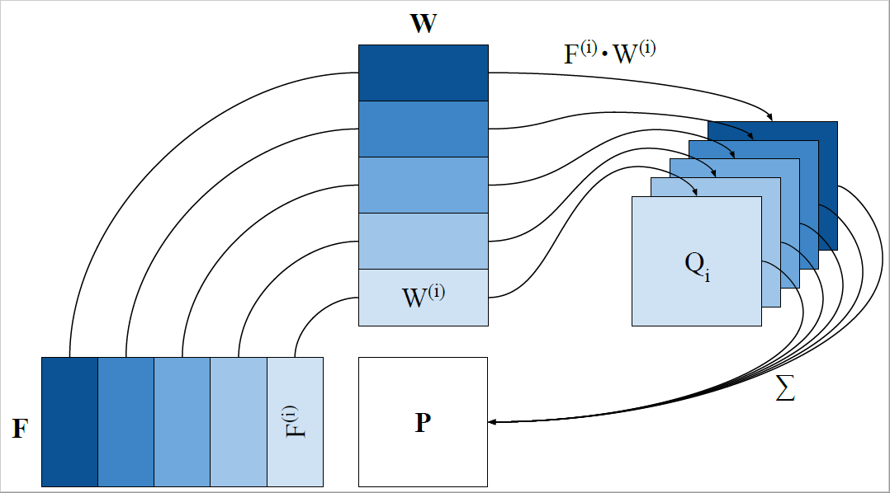

# incrementalHARE
-Calculating HARE for datasets of billions of facts using R.
-Calculating incremental HARE: an approximation of HARE scores to cobe with revisions of Knowledge Graphs



## License

This project is licensed under the
GNU Affero General Public License v3.0.
For the full license text, see [LICENSE](../LICENSE).

## Citation

DHARE has been accepted by the ACM International Conference on Hypertext and Social Media (HT '19). [The paper](https://papers.dice-research.org/2019/HT_DHARE/dhare_public.pdf) should be cited as follows:

```BibTeX
@inproceedings{10.1145/3342220.3343660,
author = {Desouki, Abdelmoneim Amer and R\"{o}der, Michael and Ngonga Ngomo, Axel-Cyrille},
title = {Ranking on Very Large Knowledge Graphs},
year = {2019},
isbn = {9781450368858},
publisher = {Association for Computing Machinery},
address = {New York, NY, USA},
url = {https://doi.org/10.1145/3342220.3343660},
doi = {10.1145/3342220.3343660},
booktitle = {Proceedings of the 30th ACM Conference on Hypertext and Social Media},
pages = {163–171},
numpages = {9},
keywords = {ranking rdf, knowledge graphs, random surfer model},
location = {Hof, Germany},
series = {HT '19}
}

```

